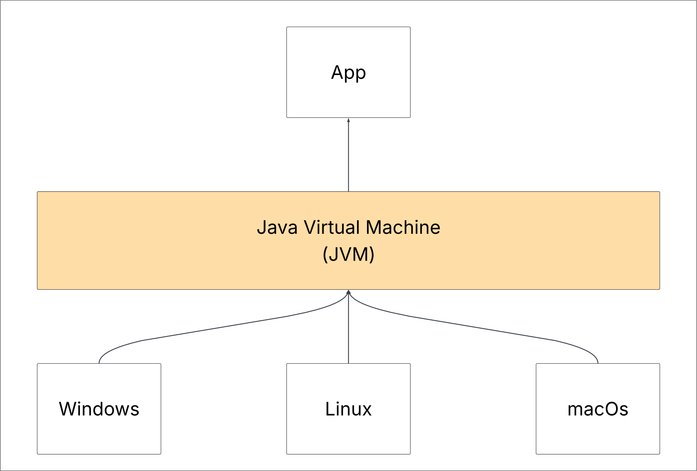

# Como o Java funciona

*Write once, run anywhere*

Esse é o slogan clássico do Java, a linguagem nasce com essa premissa, você poder rodar o mesmo código em diferentes ambientes, diferentes sistemas operacionais.

## Como o Java faz isso?

Quando programamos em Java não fazemos nosso programa para rodar em determinado sistema operacional, fazemos ele pensando em rodar na **JVM**.

A **Java Virtual Machine** é uma máquina virtual que vai rodar em cima do sistema operacional, nosso aplicativo sempre vai rodar em uma **JVM**. Cada **JVM** é especifica para cada sistema operacional.

Java é uma linguagem compilada, isso quer dizer que após terminarmos nosso código ele vai transformar ele arquivo `.class`, transformando nosso código em um Bytecode para **JVM** conseguir ler.

Nesse processo de transformação ele faz toda a verificação de erros no código.

O processo de compilação é feito pelo comando `javac`, **Java Compiler**.

Para desenvolvermos precisamos do **Java Developer Kit**, ou *JDK*. É um pacote de ferramentas essenciais, ele vem com uma **JVM**, **Java Compiler**, **Ferramentas de Debug**.

Java é uma linguagem compilada e interpretada.
